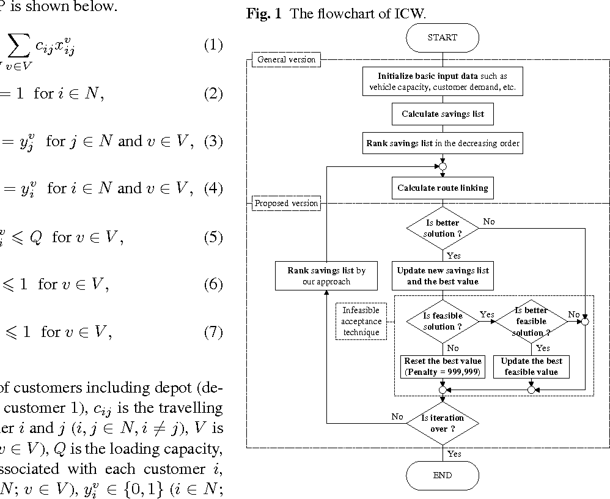
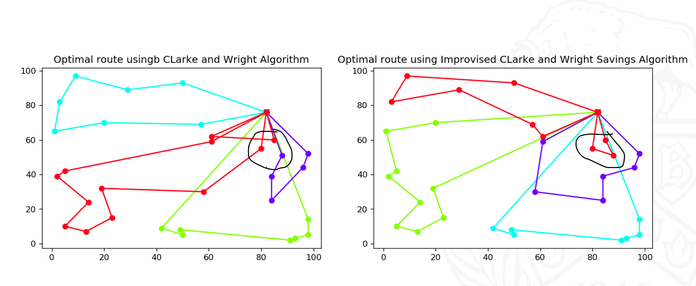

# operations-research
The Travelling salesman problem deals with finding a route connecting all the given points while also minimizing the cost of the route. 

The Vehicle routing problem is a subclass of the travelling salesman problem wherein we have a limit on the vehicle serving the points and each point has a specified demand and as a consequence multiple routes maybe needed. 

The clarke and wright algorithm is a heuristic algorithm which works on findinf the savings gained by joining two points into a route. The algorithm is described below

It is an iterative process. We compare the results with the traditional savings algorithm and take the least cost route. 

the results are shown below.

